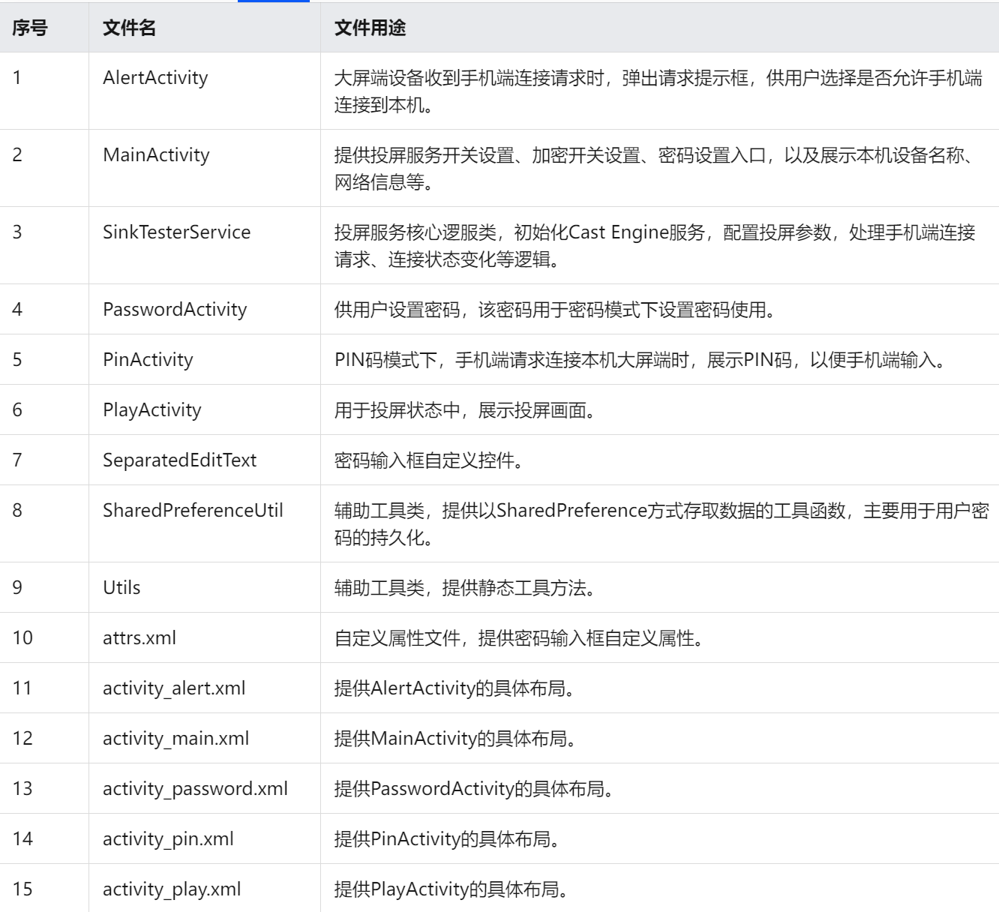

# CAST

# Step0 一些没有用上的库

## 1. 三种DNSSD库

本项目和下面的2.BonjourBrowser​项目是同一个作者，建议先看一下他写的介绍文档，包括对于Bonjour的介绍、以及Android应用程序中的Bonjour：[Bonjour in Android applications (andriydruk.com)](https://www.andriydruk.com/post/mdnsresponder/)

项目地址：[andriydruk/RxDNSSD: Android version of mDNSResponder (github.com)](https://github.com/andriydruk/RxDNSSD)

说明文档：

什么是DNS-SD？

> **DNS Service Discovery (DNS-SD)：** 是一种网络服务发现协议，允许设备在局域网中发现和连接到提供特定服务的其他设备。

‍

### 1.1 移植项目debug

* 从github clone下来RxDNSSD之后无法用AS正常解析，<mark>Gradle project sync failed. Basic functionality (e.g. editing, debugging) will not work properly</mark>，解析超时time out。

  解决方法：

  gradle版本下载不全，参照[解决Android studio Connection timed out: connect（方法全整理，持续更新）_android studio connect timed out-CSDN博客](https://blog.csdn.net/weixin_40535588/article/details/113883411)方法二
* <mark>Unsupported Java.
  Your build is currently configured to use Java 17.0.7 and Gradle 7.0.2.</mark>

  java版本和gradle版本不匹配，更换java版本比较方便

  ​`File->Settings->Build, Execution, Deployment->Build Tools->Gradle->Gradle JDK`​

  [java和gradle版本的对应关系](https://docs.gradle.org/current/userguide/compatibility.html#compatibility)

### 1.2 项目解析

* 项目提供了三种库，分别是DNSSD，RxDnssd和Rx2Dnssd

* 三种库都提供了两种接口，分别是Bindable和Embedded。以Dnssd 库为例，提供了 DNSSD 接口的两种实现：一种是<mark>DNSSBindable</mark>，是DNSSD带有系统守护程序的实现。用于API 高于4.1 的 Android 项目，以节省电池消耗（某些三星设备无法使用此实现）。另一种是<mark>DNSSDEmbedded</mark>，这是具有嵌入式DNS-SD核心的RxDnssd的实现
* 其中<mark>DNSSDEmbedded</mark>的实现在DNSSDActivity中，<mark>Rx2DnssdEmbedded</mark>的实现在MainActivity中；

  * 两者都实现了 Bonjour 服务的浏览和注册功能，并在 UI 中展示浏览到的服务信息。
  * 两者都考虑了线程处理，确保在执行网络操作时不阻塞主线程，以保持应用的响应性。
  * 两者都考虑了生命周期管理，确保在适当的生命周期方法中启动和停止服务浏览和注册。

   RxAndroidDNSSD 使用 RxJava 这样的响应式编程库，适用于那些熟悉使用 RxJava 的开发者。而 DNSSD 则是更传统的使用回调监听器的方式。根据项目介绍，`Since targetSDK = 31(Android 12) system's deamon was deprecated by Google. Consider switching to an Embedded version or some other solution.`​，还是不要使用DNSSDBindable接口。

#### 1.2.1 MainActivity.java

本文件实现的是通过Rx2DNSSD库产生bonjour服务并检测服务。

```java
findViewById(R.id.check_threads).setOnClickListener(v -> {
            /*
             *   当我们在执行browse操作时，当所有的服务都被发现并且超时时间耗尽（默认60秒）时，应该只有5个线程在活动：
             *   - main
             *   - NsdManager
             *   - Thread #<n> (it's DNSSD browse thread)
             *   - RxIoScheduler-1 (rx possibly can create more or less threads, in my case was 2)
             *   - RxIoScheduler-2
             */

            // 记录当前活动线程的数量
            Log.i("Thread", "Thread count " + Thread.activeCount() + ":");

            // 获取所有活动线程的集合
            Set<Thread> threadSet = Thread.getAllStackTraces().keySet();
            for (Thread thread : threadSet) {
                // We only interested in main group（主线程组）
                if (Objects.requireNonNull(thread.getThreadGroup()).getName().equals("main")) {
                    Log.v("Thread", thread.getName());
                }
            }
        });
```

上述代码给check_threads绑定了一个监听器，当点击这个button后，会输出当前活动线程的数量。暂时不理解设置该功能的作用是什么，gpt回答：`这段代码的目的是记录当前活动线程的数量以及主线程组中的线程名称，通常用于调试或了解当前应用程序中的线程情况。`​

‍

```java
private void register(final Button button) {
        Log.i("TAG", "register");
        button.setEnabled(false);
        BonjourService bs = new BonjourService.Builder(0, 0, Build.DEVICE, "_rxdnssd._tcp", null).port(123).build();
        // 异步操作，使用Rx2Dnssd提供的register方法来注册Bonjour服务
        registerDisposable = rxDnssd.register(bs)
                .subscribeOn(Schedulers.io())               // 指定注册操作在 IO 线程执行，以防止在主线程上执行耗时的网络操作。
                .observeOn(AndroidSchedulers.mainThread())  // 指定结果的处理发生在主线程，以便在 UI 上更新界面。
                .subscribe(bonjourService -> {              // 订阅注册操作的结果，包括成功时的回调(bonjourService)和错误时的回调(throwable)。
                    Log.i("TAG", "Register successfully " + bonjourService.toString());
                    button.setEnabled(true);
                    button.setText(R.string.unregister);
                    Toast.makeText(MainActivity.this, "Rgstrd " + Build.DEVICE, Toast.LENGTH_SHORT).show();
                }, throwable -> {
                    Log.e("TAG", "error", throwable);
                    button.setEnabled(true);
                });
    }
```

上述代码体现了响应式编程，通过 RxJava 的 Observable 来处理异步任务，用于点击register按键之后注册Bonjour 服务。

​`Bonjour 是苹果公司推出的一种服务发现协议，常用于局域网内的设备之间进行服务发现。`​

‍

```java
private void startBrowse() {
        Log.i("TAG", "start browse");
        // 使用Rx2Dnssd提供的browse()方法来开始Bonjour服务的浏览。这是一个异步操作，使用RxJava的Observable来处理结果。
        browseDisposable = rxDnssd.browse("_rxdnssd._tcp", "local.")
                .compose(rxDnssd.resolve())                 // 使用resolve()方法来解析Bonjour服务的IP地址和端口号
                .compose(rxDnssd.queryIPRecords())          // 使用queryIPRecords()方法来查询Bonjour服务的IP地址
                .subscribeOn(Schedulers.io())             
                .observeOn(AndroidSchedulers.mainThread())
                .subscribe(bonjourService -> {              // 订阅浏览操作的结果，包括成功时的回调(bonjourService)和错误时的回调(throwable)。
                    Log.d("TAG", bonjourService.toString());
                    if (bonjourService.isLost()) {
                        mServiceAdapter.remove(bonjourService);
                    } else {
                        mServiceAdapter.add(bonjourService);
                    }
                }, throwable -> Log.e("TAG", "error", throwable));
    }
```

上述代码用于开始 Bonjour 服务的浏览（browse）操作。这个操作通常用于在局域网中查找可用的 Bonjour 服务，使用Rx2Dnss库封装的browse操作实现服务浏览，实现 Bonjour 服务的浏览操作，动态地检测并更新可用服务的列表。同样是响应式编程。

‍

在初始MainActivity中，始终无法检测到其它ios设备的bonjour service，查阅资料后发现，如果要被ios设备发现，需要注册两类服务，即`airtunes`​和`airplay`​（[iOS Airplay Screen Mirroring 同屏技术详解](https://cloud.tencent.com/developer/article/1409985)）

> 对于实现的Airplay（包括Mirroring）接收端而言，首先需要注册两类服务，即airtunes和airplay。 Airtunes服务主要用来处理广播视音频接收能力协商，是最为重要的服务内容，对应Bonjour记录名称为'_raop._tcp'，注册服务端口不限，一般为了避免冲突，建议采用较高的端口数；Airplay服务主要用来兼容传统的streaming等服务，对应记录名称为'_airplay._tcp'，注册端口一般为7000。
>
> 具体的服务广播内容，可以进行局域网抓包，找到对应记录内容。
>
> 当接收端通过Bonjour广播器服务能力后，发送端（如iPhone等各类iOS设备）就可以发现该接收端。

DNSSD这个库封装很完善，也比较出名，但是笔者只成功发送了airplay和raop消息，始终无法被ios设备上的screen mirroring发现，遂换用别的库，如果后续出现问题，还是希望能够继续研究一下这个库。

‍

## 2. BonjourBrowser

项目地址：[andriydruk/BonjourBrowser: Service Browser is a utility that discovers all services registered in a network (github.com)](https://github.com/andriydruk/BonjourBrowser)

### 2.1 移植项目debug

此部分遇到的bug和1.1中一样，略

‍

## 3. AirPlay-Receiver-on-Android

项目地址：[gpfduoduo/AirPlay-Receiver-on-Android: 在Android中实现Airplay（图片+视频）的接收端 (github.com)](https://github.com/gpfduoduo/AirPlay-Receiver-on-Android)

### 3.1 移植项目bug

这个项目太老了，移植过程中出现了很多问题，其中大部分得以解决，到最后运行的时候还是出现了链接错误没有解决方法，现直接将我在过程中debug查到的资料附于下：

* [在Android Studio中找到libs文件夹的方法指南 - 掘金 (juejin.cn)](https://juejin.cn/post/7122043129057771556)

* [gradle一个项目引用另一个项目的解决方法_idea的分布式项目gradle引用子项目-CSDN博客](https://blog.csdn.net/Dkangel/article/details/105044592)

* [【Gradle】Gradle报错：Using insecure protocols with repositories,without explicit opt-in,,is unsupported._org.gradle.api.invalidusercodeexception: using ins-CSDN博客](https://blog.csdn.net/qq_46514118/article/details/121746827)

* [AAPT: error: resource color类型错误_purple_500-CSDN博客](https://blog.csdn.net/Dine647/article/details/117387726)

* [android开发-CSDN博客](https://blog.csdn.net/weixin_62437779/article/details/134950184)

* [AS升级3.1 编译报错：The SourceSet &apos;instrumentTest&apos; is not recognized by the Android Gradle Plugin._instrumenttest.setroot(&apos;tests&apos;)-CSDN博客](https://blog.csdn.net/weixin_36677647/article/details/79807105)

* [Android：Namespace not specified. Please specify a namespace in the module‘s build.gradle file like-CSDN博客](https://blog.csdn.net/Aer_7z/article/details/132198548)

* [android studio编辑区报错： usage of API documented as @since 1.8-CSDN博客](https://blog.csdn.net/frank7023/article/details/86605374)

* [Gradle DSL method not found:&apos;compile()&apos;_gradle dsl method not found: &apos;compile()-CSDN博客](https://blog.csdn.net/yao_94/article/details/78543525)

源代码中有很多库和函数在当前已经不能使用了，怀疑bug源自这些地方，同时，笔者在阅读README文档时，发现此代码在创建airplay和raop服务时获取本机MAC的方法也是旧版本的方法，在Android14（不太记得）之后这些API已经被关闭，不能直接访问到MAC地址。故这个项目虽然实现很完善，但可能并不适用。


# ----------------------正文----------------------

# Step1 IOS投屏

<mark>tips：本次开发demo以这个项目为基础，在此基础上修改与添加</mark>

项目名称：airplay_dlna_googlecast

项目地址：[alexfansz/airplay_dlna_googlecast: airplay airplay2 dlna google cast chrome cast receiver,支持Android ，windows平台 (github.com)](https://github.com/alexfansz/airplay_dlna_googlecast)

## 移植项目bug

没有出现什么大问题，唯一的问题是CMake下载，参考：[idea编写 Android 编译出现Failed to install the following SDK components:_install the missing components using the sdk manag-CSDN博客](https://blog.csdn.net/qq_45771313/article/details/120468207) 在SDK Manager中自己勾选CMake

## 项目解析

### 设备发现

如何让ios手机在原生的屏幕镜像功能中发现投屏设备，这是完成投屏的第一项任务。在<mark>PlatinumJniProxy.java</mark>文件的`startMediaRender_Java`​方法中，通过调用C++ native方法

```java
public static native int startMediaRender(String friendname,String libpath,String activecode,int width,int height ,int airtunes_port,int airplay_port,int rcv_size,Context obj );
```

启动了一个媒体渲染器，通过这个Render应该就可以实现注册服务，具体C语言代码暂时找不到，只找到了CMake编译之后的链接库。`startMediaRender_Java`​方法应该是通过判断aiplayMirrorUsingHw是否为true，从而是否发送airtunes服务，即raop

```java
    public static  int startMediaRender_Java(String friendname){
    	if (friendname == null) friendname = "";
  
    	int ret = -1;
  
    	String objpath = findLibrary1(RenderApplication.getInstance(),"mediaserver");

    	if(RenderApplication.getInstance().mDeviceInfo.aiplayMirrorUsingHw){
            ret = startMediaRender(friendname,objpath,RenderApplication.getInstance().mDeviceInfo.mMacAddress+"@"+ Build.BRAND +" "+ Build.MODEL,RenderApplication.getInstance().mDeviceInfo.width,RenderApplication.getInstance().mDeviceInfo.height,RenderApplication.getInstance().mDeviceInfo.airtunes_port, RenderApplication.getInstance().mDeviceInfo.airplay_port,128*1024,RenderApplication.getInstance());
        }else {
            ret = startMediaRender(friendname,objpath,RenderApplication.getInstance().mDeviceInfo.mMacAddress+"@"+Build.BRAND +" "+ Build.MODEL,1280, 720, RenderApplication.getInstance().mDeviceInfo.airtunes_port,RenderApplication.getInstance().mDeviceInfo.airplay_port,128*1024,RenderApplication.getInstance());
        }

        return ret;
    }
```

### 屏幕镜像

‍

# Step2 Android屏幕镜像

‍

‍

# Step3 HarmonyOS屏幕镜像

鸿蒙系统提供了投屏服务cast+kit的sdk `Huawei Cast Engine SDK`​，需要以公司开发者的身份去申请，申请网站如下：

[Huawei Cast Engine SDK下载-投屏能力 | 华为开发者联盟](https://developer.huawei.com/consumer/cn/doc/connectivity-Library/sdk-download-0000001052089401)

并且提供了demo使用范例和代码说明，只需要import该工程，再将申请到的jdk加入到lib中，修改gradle下的fileTree即可使用，demo下载地址：[代码说明-投屏能力 | 华为开发者联盟 (huawei.com)](https://developer.huawei.com/consumer/cn/doc/connectivity-Examples/code-description-0000001052439256)

投屏应用开发模版介绍：[应用开发-投屏能力 | 华为开发者联盟 (huawei.com)](https://developer.huawei.com/consumer/cn/doc/connectivity-Guides/client-dev-0000001052079439)

SDK中的API说明：[Overview-com.huawei.castpluskit-投屏能力 | 华为开发者联盟](https://developer.huawei.com/consumer/cn/doc/connectivity-References/overview-0000001052146120)

该sdk只支持EMUI10.1及以上版本

## 项目解析

首先，了解整个project的代码结构，各个源文件的功能可参考：[代码结构-投屏能力 | 华为开发者联盟 (huawei.com)](https://developer.huawei.com/consumer/cn/doc/connectivity-Examples/code-structure-0000001051839273)

​

为了和IOS投屏对齐，本项目需要去掉demo中提供的密码模式（PinActivity），因此只需要聚焦1,2,3,6,8,9这六个文件，在移植后，我将project中的`SinkTesterService.java`​更名为`HarmonyService.java`​

‍

整个HarmonyOS部分的核心代码是`HarmonyService.java`​中`CallbackHandler`​这个回调函数，部分代码如下：

```java
	case Constant.EVENT_ID_CONNECT_REQ: { //4012
                    // 大屏端跳转到投屏界面，该消息携带手机端设备信息DisplayInfo对象，开发者通过displayInfo.getProjectionDevice()获取手机端设备信息对象
                    Log.e(TAG, "handleMessage: "+"EVENT_ID_CONNECT_REQ" );
                    if (mIsPinShown) {
                        sendBroadcastToActivity(BROADCAST_ACTION_FINISH_PIN_ACTIVITY);
                        mIsPinShown = false;
                    }
                    displayInfo = (DisplayInfo) msg.obj;
                    if (displayInfo != null) {
                        mProjectionDevice = displayInfo.getProjectionDevice();
                        startPlayActivity();
                    } else {
                        Log.e(TAG, "displayInfo is null.");
                    }
                }
```

对接收到的不同消息进行不同的处理，部分消息的含义没有查找到，故不敢轻易删除，只删除了一些和密码相关的消息处理，相关注释已经标注上。

‍

‍

# Step4 流媒体投屏

项目地址：[devin1014/DLNA-Cast: 基于Cling库封装的DLNA投屏库，支持DMC、DMS、DMR功能。 (github.com)](https://github.com/devin1014/DLNA-Cast)

‍

# 附录 相关资料

[详解DNS-SD（中） – 半个一 (ycrblog.top)](https://ycrblog.top/%E8%AF%A6%E8%A7%A3dns-sd%EF%BC%88%E4%B8%AD%EF%BC%89/)

[Airplay in android device](https://stackoverflow.com/questions/14972183/airplay-in-android-device/46290441#46290441)

[Airplay error Unknown VADPortStatus: -16612](https://stackoverflow.com/questions/41594973/airplay-error-unknown-vadportstatus-16612)

[Bonjour screen mirror service not listing with iOS 11](https://developer.apple.com/forums/thread/90171)

[https://justanapplication.wordpress.com/2013/11/18/service-discovery-in-android-and-ios-part-seven-ios-take-three-down-at-c-level/](https://justanapplication.wordpress.com/2013/11/18/service-discovery-in-android-and-ios-part-seven-ios-take-three-down-at-c-level/)

[DNSServiceRegister(_:_:_:_:_:_:_:_:_:_:_:_:)](https://developer.apple.com/documentation/dnssd/1804733-dnsserviceregister)

[iOS14+ 本地网络的网络权限检测 - 简书 (jianshu.com)](https://www.jianshu.com/p/0daf226a1536)

[Domain Naming Conventions (apple.com)](https://developer.apple.com/library/archive/documentation/Cocoa/Conceptual/NetServices/Articles/domainnames.html#//apple_ref/doc/uid/TP40002460-CJBDIAHA)

[Unofficial AirPlay Specification](https://openairplay.github.io/airplay-spec/service_discovery.html)

[iOS Airplay Screen Mirroring 同屏技术详解](https://cloud.tencent.com/developer/article/1409985)

[IANA端口号列表](http://www.iana.org/assignments/port-numbers)

[airplay协议开发第3部(mdnsd注册airplay服务)](https://blog.csdn.net/feng19870412/article/details/88977909)

[Unofficial AirPlay Protocol Specification (nto.github.io)](https://nto.github.io/AirPlay.html#servicediscovery-airtunesservice)

[多屏互动技术研究（三）之Airplay研究_airplay fp-setup-CSDN博客](https://blog.csdn.net/u011897062/article/details/79446001?spm=1001.2014.3001.5502)

[gpfduoduo/AirPlay-Receiver-on-Android: 在Android中实现Airplay（图片+视频）的接收端 (github.com)](https://github.com/gpfduoduo/AirPlay-Receiver-on-Android)

[java - 如何修复 Android Studio 中的 &apos;&apos;module java.base does not &quot;opens java.io&quot; to unnamed module &apos;&apos; 错误？_Stack Overflow中文网](https://stackoverflow.org.cn/questions/67782975)

[Android BuildConfig不生成的解决办法_build type &apos;debug&apos; contains custom buildconfig fie-CSDN博客](https://blog.csdn.net/yuzhiqiang_1993/article/details/130431271)

‍
